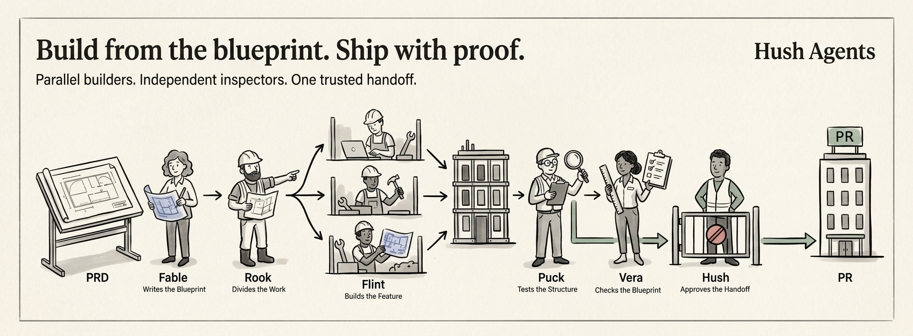

<p align="center">
  
</p>

<h1 align="center">Hush Agents</h1>

<p align="center">
  Turn a PRD into code without letting one agent grade its own homework.
</p>

<p align="center">
  <a href="https://www.npmjs.com/package/hush-agents"></a>
  <a href="https://www.npmjs.com/package/hush-agents"></a>
  <a href="https://github.com/rhyumiranda/hush-agents/stargazers"></a>
  <a href="https://github.com/rhyumiranda/hush-agents/blob/main/LICENSE"></a>
</p>

Hush Agents turns product intent into scoped implementation, independent
verification, and requirement alignment across coding harnesses.

## Install

Install all agents and skills:

```sh
npx hush-agents install
```

Choose agents:

```sh
npx hush-agents install --agents fable,rook
```

List: `npx hush-agents list-agents`.

```sh
npx hush-agents codex-register --agents fable,rook
```

Restart Codex; edits `~/.codex/config.toml`. Use `--dry-run` to preview.

Check:

```sh
npx hush-agents doctor
```

Paths:

| Harness | Agents | Skills |
|---|---|---|
| Codex | `~/.codex/agents` | `hush-agents`, `readme-craft` |
| Claude Code | `~/.claude/agents` | `hush-agents`, `readme-craft` |
| Gemini CLI | `~/.gemini/agents` | `hush-agents`, `readme-craft` |
| OpenCode | `~/.config/opencode/agents` | `hush-agents`, `readme-craft` |

Install only the workflow skill with `skills`:

```sh
npx skills add rhyumiranda/hush-agents --skill hush-agents
```

## Run The Workflow

Give the crew a PRD or product intent in your harness:

```text
@fable turn this PRD into clear, traceable requirements
@rook split the requirements into dependency-aware tasks
@flint implement task T-01 in its assigned worktree
@puck verify the frozen candidate independently
@vera compare the implementation with the approved requirements
@hush route the next step and accept only when the evidence is complete
```

Or invoke the full workflow skill:

```text
$hush-agents run this PRD through the implementation and verification loop
```

The useful result is not just passing tests. You get a chain of evidence:
requirements, task graph, immutable packet, implementation report, verification
report, alignment report, and acceptance record.

## Try The Runtime

Use a packet produced by Hush to check its shape and digest:

```sh
hush-agents validate-packet path/to/packet.json
```

Use hash-anchored editing when a worker must change an existing file:

```sh
hush-agents hashline-read src/file.js
hush-agents hashline-patch src/file.js patch.json --dry-run
```

If a packet is stale, incomplete, or out of scope, the command reports the
reason instead of silently accepting it.

## Run One Workflow

For a configured adapter run, use the resumable command boundary:

```sh
hush-agents run docs/prd.md --repo . --target main \
  --config .hush/run-config.json --json
```

The JSON config names adapters, setup, hazards, capacity, and checks. Use
`--dry-run` to validate without dispatch; use `--resume <run-id>` after an
interruption. Exit `0` means local `READY_FOR_PR`, not a target-branch merge.

Adapter bridge: `hush-agents harness-adapter --harness <name> --agent <role>`.
Use `codex`, `claude`, `gemini`, or `opencode`; set provider names in `pass_env`.

Completed runs remove clean task worktrees; dirty ones remain for review.

## The Crew

| Agent | Responsibility | Boundary |
|---|---|---|
| **Fable** | Turns intent into requirements and preserves unknowns. | Does not implement. |
| **Rook** | Maps requirements to code surfaces and safe task batches. | Blocks unsafe parallel work. |
| **Flint** | Implements one scoped task in one worktree. | Does not grade its own work. |
| **Puck** | Tests the frozen candidate independently. | Does not patch code. |
| **Vera** | Compares lifted behavior with approved requirements. | Does not patch code. |
| **Hush** | Owns packets, state, routing, worktrees, retries, and acceptance. | Accepts only valid evidence. |

## How It Works

1. **Fable** gives requirements stable IDs and records ambiguity.
2. **Rook** builds a dependency graph and marks tasks that can run in parallel.
3. **Hush** issues one immutable packet per task.
4. **Flint** edits only its allowed surfaces in an isolated worktree.
5. **Hush** freezes the candidate snapshot.
6. **Puck** checks behavior; **Vera** checks alignment when required.
7. Independent tasks continue in parallel. Shared files, migrations, auth,
   global state, and shared fixtures stay ordered.
8. **Hush** integrates once at the PR boundary and reruns only checks affected
   by changed behavior or dependencies.

If a gate fails, the smallest proven fix is made and only the affected gate is
rerun. A clean rebase does not automatically invalidate evidence when the patch
and affected dependencies are unchanged.

`validate-packet` checks packet shape, digest, scope, target agent, dependencies,
and status context. Hashline editing rejects stale reads before writing. Runtime
events are append-only under `.hush/runs/<run_id>/events.jsonl`.

## Evidence

See the [runtime report](docs/live-agent-shipping-runtime-report.md) for a
complete evidence chain.

## Contributing

```sh
npm test
npm run pack:check
npm run build:claude-agents
```

## Go Deeper

- [Workflow skill](skills/hush-agents/SKILL.md)
- [Packet schema](schemas/packet.schema.json)
- [Live runtime report](docs/live-agent-shipping-runtime-report.md)

## License

MIT
